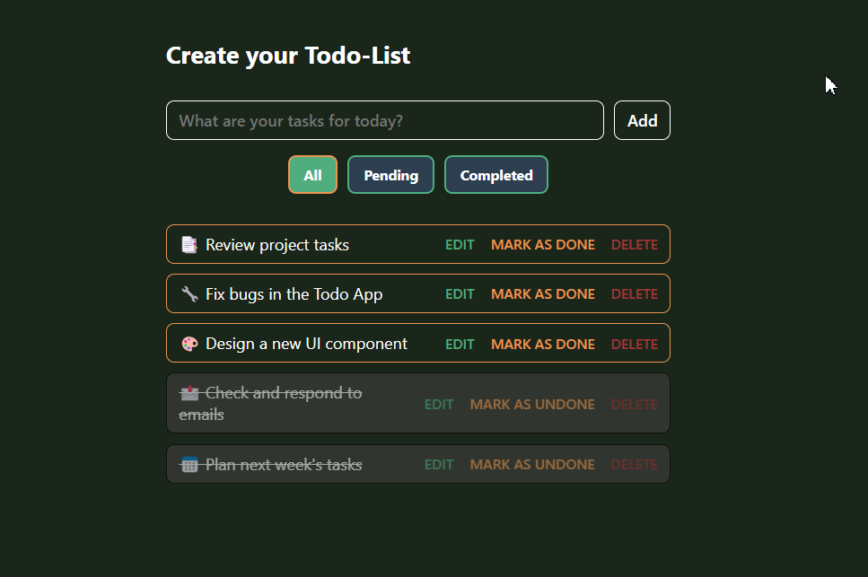

# 📌 Todo App - Simple & Efficient Task Manager



## 🚀 Introduction
This **Todo App** is a simple and user-friendly task management application that helps you organize your daily tasks efficiently. It allows you to **add, edit, delete, mark as completed**, and **filter tasks** based on their status.

🔗 **Live Demo:** [Todo App](https://thanhhang31023.github.io/todo-app-javascript/)

## 🎯 Features
✅ **Add new tasks**  
✅ **Edit tasks**  
✅ **Delete tasks**  
✅ **Mark tasks as completed**  
✅ **Task filtering** (`All`, `Pending`, `Completed`)  
✅ **Drag & drop to reorder tasks**  
✅ **Data is saved in LocalStorage**  
✅ **Responsive & modern UI with smooth animations**  

## 🛠️ Tech Stack
- **HTML** - Page structure  
- **CSS** - Styling & animations  
- **JavaScript** - Task management logic  
- **LocalStorage** - Saves tasks in the browser  

## 📝 Installation
1. **Clone the repository:**  
   ```bash
   git clone https://github.com/thanhhang31023/todo-app-javascript.git
   ```
2. **Navigate to the project directory:**
   ```sh
   cd todo-app-javascript

   ```
3. **Open the project in VS Code:**
   ```sh
   code .
   ```
4. **Open `index.html` in your browser**

## 📌 How to Use

🔴 **1️⃣ Enter your task in the input box and click `"Add"`**  

🔵 **2️⃣ Use the available buttons:**  
- ✏ **Edit** - Modify a task  
- ✅ **Mark as Done** - Mark a task as completed  
- ❌ **Delete** - Remove a task  

🔷 **3️⃣ Use the filter buttons** (**All | Pending | Completed**) **to organize your tasks.**

## 📬 Contact
- 👤 **NGUYEN THI THANH HANG**
- 📧 **thanhhang31023@gmail.com**

